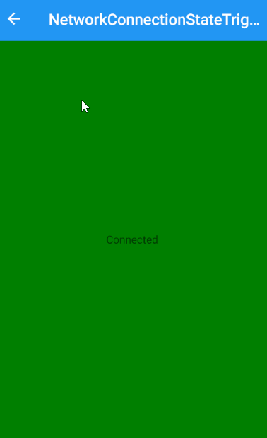

# XamarinFormsStateTriggers

A collection of custom visual state triggers for Xamarin.Forms.

##### Triggers available:

- `EnergySaverStatusStateTrigger`: Trigger based on battery energy saver state.
- `NetworkConnectionStateTrigger`: Trigger if internet connection is available or not.
  
## Copyright and license

Code released under the [MIT license](https://opensource.org/licenses/MIT).